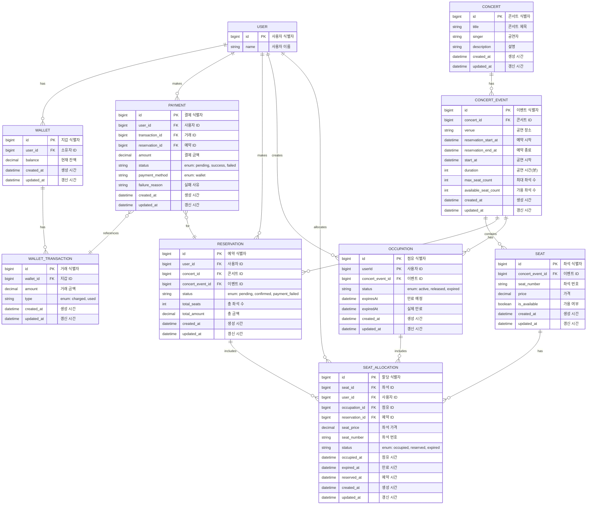

# 목차

- [프로젝트 개요](#프로젝트-개요)
    - [주요 목표](#주요-목표)
    - [주요 기능](#주요-기능)
- [기술 스택](#기술-스택)
    - [백엔드](#백엔드)
    - [데이터베이스](#데이터베이스)
    - [캐싱](#캐싱)
    - [메시지 큐](#메시지-큐)
    - [아키텍처 및 디자인 패턴](#아키텍처-및-디자인-패턴)
    - [동시성 제어](#동시성-제어)
    - [테스트](#테스트)
    - [모니터링 및 로깅](#모니터링-및-로깅)
- [시스템 아키텍처](#시스템-아키텍처)
    - [전체 구조도](#전체-구조도)
    - [계층별 설명](#계층별-설명)
    - [주요 설계 특징](#주요-설계-특징)
- [ERD](#ERD)
- [주요 기술적 도전과 해결 방안](#주요-기술적-도전과-해결-방안)
    - [대규모 트래픽 처리](#대규모-트래픽-처리)
    - [동시성 제어](#동시성-제어)
    - [분산 환경에서의 데이터 일관성](#분산-환경에서의-데이터-일관성)
    - [성능 최적화](#성능-최적화)
- [실행 방법](#실행-방법)
    - [환경 설정](#환경-설정)
    - [빌드 및 실행 방법](#빌드-및-실행-방법)
- [회고](#회고)

# 프로젝트 개요

특정 일시에 정원이 N명인 콘서트의 좌석을 예약할 수 있는 서비스를 개발하는 것을 목표로 합니다.

## 주요 목표

- 공정한 예매 기회 제공: 대기열 시스템을 통해 모든 사용자에게 동등한 기회를 제공합니다.
- 동시성 문제 해결: 같은 좌석에 대한 중복 예매를 방지하고, 안정적인 거래를 보장합니다.
- 분산 환경 지원: 다수의 인스턴스로 애플리케이션이 동작하더라도 기능에 문제가 없도록 합니다.
- 사용자 경험 개선: 실시간 정보 제공으로 사용자 만족도를 높입니다.

## 주요 기능

- [시나리오](./docs/scenario.md)

### 대기열 관리 시스템

- 사용자별 대기열 토큰 발급
- 대기 순서 및 잔여 시간 정보 제공
- 폴링 방식을 통한 대기열 상태 확인
- 요청 순서에 따른 정확한 대기열 관리

### 잔액 관리 시스템

- 사용자 잔액 충전 및 조회 기능
- 좌석 예약 시 충전된 잔액 사용

### 좌석 점유 시스템

- 일정 시간 동안의 좌석 점유 기능
- 점유 시간 동안 다른 사용자의 접근 제한
- 점유 시간 초과 시 자동 해제 기능
- 점유 시간은 정책에 따라 변경 가능

### 예약 시스템

- 콘서트 예약 가능 날짜 조회
- 특정 날짜의 예약 가능 좌석 목록 조회
- 좌석 번호 부여 (1번부터 50번까지)
- 특정 날짜와 좌석 번호로 예약 기능

### 결제 시스템

- 결제 완료 시 결제 내역 생성
- 결제 완료 시 좌석 예약 확정
- 결제 완료 또는 예약 활동 종료 시 대기열에서 제거

# 기술 스택

## 백엔드

- 언어: Kotlin
- 프레임워크: Spring Boot
- 빌드 도구: Gradle

## 데이터베이스

- RDBMS: MySQL 8.0
- ORM: Spring Data JPA

Spring Data JPA를 사용하여 객체-관계 매핑을 구현하였으며, 이를 통해 데이터베이스 조작을 더욱 객체지향적으로 수행할 수 있었습니다.

## 캐싱

- 인메모리 데이터 저장소: Redis

Redis 를 사용하여 대기열 관리, 분산 락 구현, 그리고 자주 접근되는 데이터의 캐싱을 구현했습니다. 이를 통해 시스템의 응답 시간을 크게 개선하고, 데이터베이스의 부하를 줄일 수 있었습니다.

## 메시지 큐

- 분산 이벤트 스트리밍 플랫폼: Apache Kafka

Kafka를 도입하여 결제 후 처리해야하는 로직을 비동기로 처리할 수 있도록 구현했습니다. 이를 통해 시스템의 확장성과 안정성을 높이고, 서비스 간 결합도를 낮출 수 있었습니다.

## 아키텍처 및 디자인 패턴

- 아키텍처: Layered Architecture, Clean Architecture
- 도메인 주도 설계(DDD) 원칙 적용

Layered Architecture 와 Clean Architecture 를 결합하여 관심사를 명확히 분리하고, 각 계층 간의 의존성을 제어했습니다. 또한 DDD 원칙을 적용하여 비즈니스 로직을 도메인 모델에
집중시키고, 복잡한 비즈니스 규칙을 효과적으로 표현했습니다.

## 동시성 제어

- 분산 락: Redisson 을 이용한, Pub/Sub 구조의 분산락 구현
- 데이터베이스 락: Pessimistic Lock, Optimistic Lock 활용

동시성 문제를 해결하기 위해 Redis 기반의 분산 락과 데이터베이스 수준의 락을 병행하여 사용했습니다. 이를 통해 분산 환경에서도 데이터 일관성을 유지하고 동시성 이슈를 효과적으로 관리할 수 있었습니다.

## 테스트

다양한 레벨의 테스트를 구현하여 시스템의 안정성과 신뢰성을 확보했습니다. 특히 k6를 이용한 부하 테스트를 통해 대규모 트래픽 상황에서의 시스템 성능을 검증했습니다.

- 단위 테스트: JUnit 5
- 통합 테스트: Spring Boot Test
- 부하 테스트: k6
    - [사용한 스크립트](./docs/report_about_load_test.md)

## 모니터링 및 로깅

- 모니터링: Prometheus, Grafana
- 로깅: Logback

시스템의 실시간 모니터링을 위해 Prometheus 와 Grafana 를 활용했으며, 로그 관리를 위해 Logback 을 사용했습니다. 이를 통해 시스템의 상태를 실시간으로 파악하고, 문제 발생 시 신속하게 대응할
수 있는 체계를 구축했습니다.

# 시스템 아키텍처

본 프로젝트는 Layered Architecture 및 Clean Architecture 와 DDD(Domain-Driven Design) 원칙을 기반으로 구현되었으며, 다음과 같은 계층 구조를 가집니다.

## 전체 구조도

```
[Interfaces] → [Application] → [Domain] ← [Infrastructure]
```

## 계층별 설명

### Interfaces 계층

- 위치: `interfaces/` 디렉토리
- 역할: 외부 시스템과의 상호작용을 담당
- 주요 컴포넌트:
    - API Controllers: REST API 엔드포인트 정의
    - DTOs: 요청/응답 데이터 구조 정의
    - Filters & Interceptors: 요청 전처리 및 후처리
    - Consumers: Kafka 메시지 소비자
    - Schedulers: 주기적 작업 실행

### Application 계층

- 위치: `application/` 디렉토리
- 역할: 비즈니스 유스케이스 정의 및 구현
- 주요 컴포넌트:
    - UseCases: 각 비즈니스 기능에 대한 인터페이스 및 구현체
    - DTOs: 애플리케이션 내부에서 사용되는 데이터 구조

### Domain 계층

- 위치: `domain/` 디렉토리
- 역할: 핵심 비즈니스 로직 및 규칙 정의
- 주요 컴포넌트:
    - Models: 도메인 엔티티 및 값 객체
    - Repositories: 데이터 접근 인터페이스
    - Services: 도메인 로직 처리
    - Events: 결제 관련 도메인 이벤트 정의
    - Exceptions: 도메인 예외 정의
- [도메인 모델 상세 내용](./docs/domain_models.md)

### Infrastructure 계층

- 위치: `infrastructure/` 디렉토리
- 역할: 외부 시스템 및 프레임워크와의 통합
- 주요 컴포넌트:
    - JPA Entities & Repositories: 데이터베이스 접근 구현
    - Redis: 캐싱 및 분산 락 구현
    - Kafka: 결제 관련 메시지 큐 생산자 구현
    - JWT: 토큰 기반 인증 구현
    - Slack: 알림 서비스 구현

### 공통 컴포넌트

- 위치: `config/`, `common/` 디렉토리
- 역할: 애플리케이션 전반에 걸친 설정 및 유틸리티 제공
- 주요 컴포넌트:
    - Configurations: Spring Boot 설정 클래스
    - Swagger: API 문서화
    - Common Utilities: 공통으로 사용되는 유틸리티 함수

## 주요 설계 특징

- **의존성 역전 원칙 (DIP) 적용**
    - Domain 계층은 외부 계층에 의존하지 않으며, Application 계층을 통해 Infrastructure 계층과 소통합니다.
- **유스케이스 중심 설계**
    - 각 비즈니스 기능은 별도의 UseCase로 정의되어 있어, 단일 책임 원칙을 준수합니다.
- **결제 도메인에 한정된 이벤트 기반 아키텍처**
    - 결제 처리 시 도메인 이벤트를 사용하여 느슨한 결합을 유지하며, Kafka를 이용한 비동기 처리를 구현했습니다.

# ERD



# 주요 기술적 도전과 해결 방안

## 대규모 트래픽 처리

### 도전 과제

콘서트 티켓 예매 시스템의 특성상, 티켓 오픈 시 짧은 시간 동안 대량의 트래픽이 집중됩니다. 이러한 상황에서 시스템의 안정성과 성능을 유지하는 것이 큰 도전이었습니다.

### 해결 방안

**대기열 시스템 구현** ([상세 내용](./docs/report_about_queue_system.md))

- Redis의 Sorted Set을 활용하여 효율적인 대기열 관리 시스템을 구현했습니다.
- 대기 큐와 활성 큐를 분리하여 관리하고, 토큰의 TTL을 추적합니다.
- 사용자에게 대기열 토큰을 발급하고, 순차적으로 예매 과정을 진행하도록 했습니다.
- 10초마다 1,400개의 토큰을 활성 큐로 이동시키는 전략을 채택했습니다.
- 대기열의 상태를 실시간으로 제공하여 사용자 경험을 개선했습니다.

**캐싱 전략** ([상세 내용](./docs/report_about_caching.md))

- Redis를 이용해 자주 조회되는 데이터(콘서트 정보)를 캐싱하여 데이터베이스 부하를 줄이고 응답 시간을 개선했습니다.
- 캐싱 적용 결과, 콘서트 목록 조회 API의 응답 시간이 401ms에서 43.3ms로 약 89% 개선되었습니다.
- 콘서트 이벤트 조회 API도 64.8ms에서 54.9ms로 약 15% 개선되었습니다.

## 동시성 제어

### 도전 과제

여러 사용자가 동시에 같은 좌석을 예매하려 할 때, 그리고 동시에 지갑 잔액을 충전하거나 사용할 때 발생할 수 있는 동시성 문제를 해결해야 했습니다.

### 해결 방안 ([상세 내용](./docs/report_of_race_condition.md))

**분산 락(Distributed Lock)과 비관적 락(Pessimistic Lock) 조합**

- Redis를 이용한 분산 락과 데이터베이스의 비관적 락을 조합하여 사용했습니다.
- 이 방식은 다른 접근법(비관적 락만 사용, 낙관적 락 사용)에 비해 성능이 우수했습니다.
- 특히 사용자 수가 증가할수록 이 방식의 성능 우위가 두드러졌습니다.

**성능 테스트 결과**

- 5,000명의 동시 사용자 테스트에서:
    - 분산 락 + 비관적 락: 1,825.0ms
    - 비관적 락만 사용: 4,382.3ms
    - 낙관적 락 사용: 3,264.0ms

**지갑 잔액 관리**

- 분산 락을 사용하여 동시에 발생하는 충전과 사용 요청을 순차적으로 처리했습니다.
- 이를 통해 잔액의 정확성을 보장하고 동시성 문제를 해결했습니다.

## 분산 환경에서의 데이터 일관성

### 도전 과제

분산 환경에서 여러 서비스 간의 데이터 정합성을 유지하는 것이 중요한 과제였습니다.

### 해결 방안

**이벤트 기반 아키텍처**

- 결제 도메인에 한정하여 이벤트 기반 아키텍처를 도입했습니다.
- Kafka를 통해 결제 완료 이벤트를 발행하고, 이를 구독하여 후속 처리를 진행했습니다.

**트랜잭션 아웃박스 패턴(Transactional Outbox Pattern) 구현**

- 결제 처리 시 로컬 데이터베이스에 결제 정보를 저장하고 동시에 아웃박스 테이블에 메시지를 저장했습니다.
- 별도의 프로세스가 주기적으로 아웃박스 테이블을 확인하고 미발행 메시지를 Kafka로 발행하도록 구현했습니다.

**멱등성(Idempotency) 보장**

- 각 작업(예: 결제, 예약)에 대해 고유한 식별자를 부여하고, 중복 처리를 방지하는 로직을 구현했습니다.
- 이를 통해 네트워크 오류 등으로 인한 중복 요청 시에도 데이터 일관성을 유지할 수 있었습니다.

## 성능 최적화

### 캐싱 전략 ([상세 내용](./docs/report_about_caching.md))

Redis 를 활용하여 자주 접근되는 데이터를 캐싱함으로써 데이터베이스 부하를 줄이고 응답 시간을 개선했습니다.

- 콘서트 조회 API 캐싱
    - 콘서트 정보는 자주 변경되지 않는 특성을 활용
    - 캐싱 적용 결과, 응답 시간이 401ms에서 43.3ms로 약 89% 개선
- 콘서트 이벤트 조회 API 캐싱
    - 예약 가능한 날짜 정보를 캐싱
    - 응답 시간이 64.8ms에서 54.9ms로 약 15% 개선
- 캐싱 제외 항목
    - 실시간성이 중요한 데이터(예: 좌석 가용성, 결제 정보)는 캐싱에서 제외

**캐싱 적용 결과**

- 전체 시스템의 처리량이 초당 2.73 요청에서 4.41 요청으로 61.41% 증가
- 평균 응답 시간이 47.36ms에서 55.43ms로 소폭 증가했지만, 이는 처리량 증가로 인한 것으로 판단됩니다.

### 데이터베이스 인덱싱 ([상세 내용](./docs/report_about_indexing.md))

데이터베이스 쿼리 성능을 개선하기 위해 적절한 인덱스를 설계하고 적용했습니다.

- 콘서트 이벤트 테이블 인덱싱
    - `(concert_id, reservation_start_at DESC, reservation_end_at DESC)` 복합 인덱스 적용
    - 대규모 데이터셋(200만 개의 콘서트 이벤트)에서 쿼리 실행 시간을 0.09ms 수준으로 유지
- 좌석 테이블 인덱싱
    - `(concert_event_id DESC, is_available)` 복합 인덱스 적용
    - 1000만 개의 좌석 데이터에서 쿼리 실행 시간을 0.07ms 수준으로 개선

**인덱싱 적용 결과**

- 콘서트 이벤트 조회 쿼리의 실행 시간을 378.8ms에서 0.09ms로 대폭 개선
- 좌석 조회 쿼리의 실행 시간을 1064.14ms에서 0.07ms로 획기적으로 개선

# 실행 방법

본 프로젝트는 Docker 를 사용하여 쉽게 실행할 수 있습니다.

## 환경 설정

1. `프로젝트 루트/docker` 디렉토리에 `.env` 파일을 생성합니다.
2. `.env.example` 파일을 참고하여 필요한 환경 변수를 설정합니다.

## 빌드 및 실행 방법

- `Makefile` 을 작석해서, 프로젝트 루트에서 간단한 명령어로 빌드 및 실행을 할 수 있도록 했습니다.
- 프로젝트 루트 디렉토리에서 다음 명령어를 실행합니다.
- Docker 이미지 빌드

    ```bash
    make build
    ```

- 컨테이너 실행

    ```bash
    make up
    ```

- 로그 확인

    ```bash
    make logs
    ```

- 컨테이너 중지 및 제거

    ```bash
    make down
    ```

### 개발 환경과 운영 환경

- 개발 환경
    - `Dockerfile.local`을 사용합니다.
    - 이 환경에서는 소스 코드가 볼륨으로 마운트되어 실시간으로 변경사항이 반영됩니다.
- 운영 환경
    - `Dockerfile.prod`를 사용합니다.
    - 이 환경에서는 최적화된 빌드 결과물이 실행됩니다.

### Docker Containers

- Spring Boot 애플리케이션: `http://localhost:8080`
- MySQL: `localhost:3306`
- Redis: `localhost:6379`
- Kafka: `localhost:9092`
- Prometheus: `http://localhost:9090`
- Grafana: `http://localhost:3000`

### API 문서

API 문서는 `Swagger UI` 를 통해 확인할 수 있습니다. 애플리케이션 실행 후 다음 URL 에서 확인 가능합니다

```html
http://localhost:8080/swagger-ui.html
```

# 회고

- [중간 회고](./docs/half-review.md)
- [최종 발표 ppt](https://docs.google.com/presentation/d/1AGbdR4t3ng4Dao4OwE01uUnlFz8G8sx7j2oObixXWWs/edit?usp=sharing)