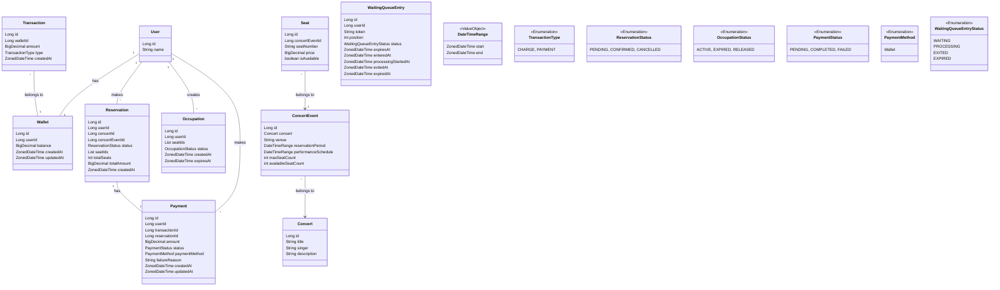

# 도메인 모델

## 핵심 개념 식별

### 엔티티

1. User: 사용자 정보를 관리
2. Wallet: 사용자의 잔액 정보를 관리
3. Transaction: 잔액 변동 내역을 기록
4. Concert: 콘서트의 기본 정보를 관리
5. ConcertEvent: 특정 날짜와 장소의 콘서트 이벤트를 관리
6. Seat: 콘서트 이벤트의 좌석 정보를 관리
7. Reservation: 좌석 예약 정보를 관리
8. Occupation: 좌석 임시 점유 정보를 관리
9. Payment: 결제 정보를 관리
10. WaitingQueueEntry: 대기열 정보를 관리

### 값 객체

1. DateTimeRange: start 부터 end 까지를 표현
2. TransactionType: CHARGE, PAYMENT
3. SeatStatus: AVAILABLE, OCCUPIED, RESERVED
4. ReservationStatus: PENDING, CONFIRMED, CANCELLED
5. OccupationStatus: ACTIVE, EXPIRED, RELEASED
6. PaymentStatus: PENDING, COMPLETED, FAILED
7. WaitingQueueEntryStatus: READY, PROCESSING, EXITED, EXPIRED

## 바운디드 컨텍스트 및 애그리거트

### a. 사용자 관리 컨텍스트

- User 애그리게이트
    - 루트: User
    - 포함 엔티티: (없음)
    - 값 객체: (없음)

### b. 잔액 관리 컨텍스트

- Wallet 애그리게이트
    - 루트: Wallet
    - 포함 엔티티: Transaction
    - 값 객체: TransactionType

### c. 콘서트 관리 컨텍스트

- Concert 애그리게이트
    - 루트: Concert
    - 포함 엔티티: ConcertEvent, Seat
    - 값 객체: SeatStatus

### d. 예약 및 점유 관리 컨텍스트

- Reservation 애그리게이트
    - 루트: Reservation
    - 포함 엔티티: (없음)
    - 값 객체: ReservationStatus
- Occupation 애그리게이트
    - 루트: Occupation
    - 포함 엔티티: (없음)
    - 값 객체: OccupationStatus

### e. 결제 컨텍스트

- Payment 애그리게이트
    - 루트: Payment
    - 포함 엔티티: (없음)
    - 값 객체: PaymentStatus

### f. 대기열 관리 컨텍스트

- WaitingQueue 애그리게이트
    - 루트: WaitingQueue
    - 포함 엔티티: (없음)
    - 값 객체: WaitingQueueStatus

## 도메인 모델 다이어그램

