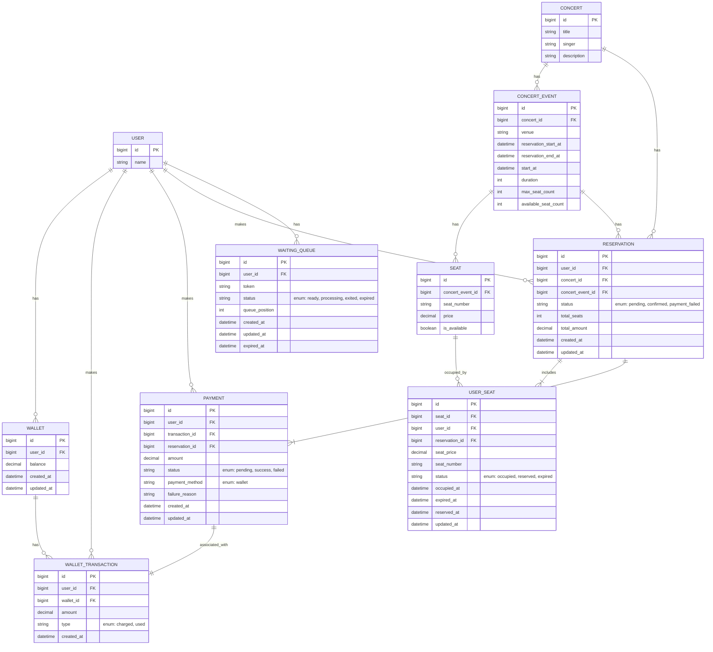

# 콘서트 좌석 예매 서비스 ERD

## USER

- 사용자를 나타내는 Table 이다.
- 아래의 attributes 를 갖는다.
    - id: PK
    - name: 이름

## WALLET

- 사용자의 잔액을 나타내는 Table 이다.
- 아래의 attributes 를 갖는다.
    - id: PK
    - user_id: USER 를 가르키는 FK
    - balance: 잔액
    - created_at: 생성일시
    - updated_at: 수정일시

## WALLET_TRANSACTION

- 사용자의 잔액 변화 내역을 나타내는 Table 이다.
- 아래의 attributes 를 갖는다.
    - id: PK
    - user_id: USER 를 가르키는 FK
    - wallet_id: WALLET 을 가르키는 FK
    - amount: 변화된 금액
    - type: 내역의 종류
        - charged: 충전
        - used: 사용
    - at: 변화 일시

## PAYMENT

- 사용자의 결제 내역을 나타내는 Table 이다.
- 아래의 attributes 를 갖는다.
    - id: PK
    - user_id: USER 를 가르키는 FK
    - transaction_id: WALLET_TRANSACTION 을 가르키는 FK
    - reservation_id: RESERVATION 을 가르키는 FK
    - status: 결제 상태
        - pending: 결제 시도 중
        - success: 결제 성공
        - failed: 결제 실패
    - amount: 결제 금액
    - payment_method: 결제 수단
        - wallet
    - failure_reason: 실패 이유로, status 가 failed 때만 값이 있음
    - created_at: 결제 일시
    - updated_at: 수정 일시

## CONCERT

- 콘서트의 핵심 정보를 나타내는 Table 이다.
- 아래의 attributes 를 갖는다.
    - id: PK
    - title: 콘서트 제목
    - singer: 가수
    - description: 설명

## CONCERT_EVENT

- 실제 열리는 콘서트의 정보를 나타내는 Table 이다
- 아래의 attributes 를 갖는다.
    - id: PK
    - concert_id: CONCERT 를 가르키는 FK
    - venue: 콘서트 장소
    - reservation_start_at: 예약 시작 시간
    - reservation_end_at: 예약 종료 시간
    - start_at: 공연 시작 일시
    - duration: 공연 시간(분 단위)
    - max_seat_count: 최대 좌석 수
    - available_seat_count: 사용 가능한 좌석 수

## SEAT

- 실제 열리는 콘서트의 좌석 정보를 나타내는 Table 이다.
- 아래의 attributes 를 갖는다.
    - id: PK
    - concert_event_id: CONCERT_EVENT 를 가르키는 FK
    - seat_number: 좌석 번호
    - price: 가격
    - is_available: 선택 가능한가

## USER_SEAT

- 사용자가 선택하거나 예약한 좌석 정보를 나타내는 Table 이다
- 아래의 attributes 를 갖는다.
    - id: PK
    - seat_id: SEAT 를 가르키는 FK
    - user_id: USER 를 가르키는 FK
    - reservation_id: RESERVATION 을 가르키는 FK
    - seat_price: 좌석 가격
    - seat_number: 좌석 번호
    - status: 좌석에 대한 상태
        - occupied: 좌석이 점유된 상태 (default)
        - reserved: 좌석이 예약된 상태
        - expired: 좌석에 대한 점유 시간이 만료된 상태
    - occupied_at: 점유 일시
    - expired_at: 점유 만료 일시
    - reserved_at: 예약 완료 일시
    - updated_at: 수정 일시

## RESERVATION

- 사용자의 좌석 예약 정보를 나타내는 Table 이다.
- 아래의 attributes 를 갖는다.
    - id: PK
    - user_id: USER 를 가르키는 FK
    - concert_id: CONCERT 를 가르키는 FK
    - concert_event_id: CONCERT_EVENT 를 가르키는 FK
    - status: 예약 상태
        - pending: 결제 대기 중인 상태
        - payment_failed: 결제 실패 상태
        - confirmed: 결제가 완료되고 예약이 확정된 상태
    - total_seats: 총 예약 좌석 수
    - total_amount: 총 예약 금액
    - created_at: 예약 생성 일시
    - updated_at: 수정 일시

## WAITING_QUEUE

- 대기열을 나타내는 Table 이다.
- 활성 상태('ready', 'processing')인 row 의 수가 대기열의 사이즈이다.
- 아래의 attributes 를 갖는다.
    - id: PK
    - user_id: USER 를 가르키는 FK
    - token: 대기표 토큰
    - status: 상태
        - ready: 작업 대기 상태
        - processing: 작업 가능 상태
        - exited: queue 에서 제거된 상태
        - expired: 만료된 상태
    - queue_position: 대기열에서의 위치
    - created_at: 생성 시간
    - updated_at: 수정 일시
    - expired_at: 만료 시간

