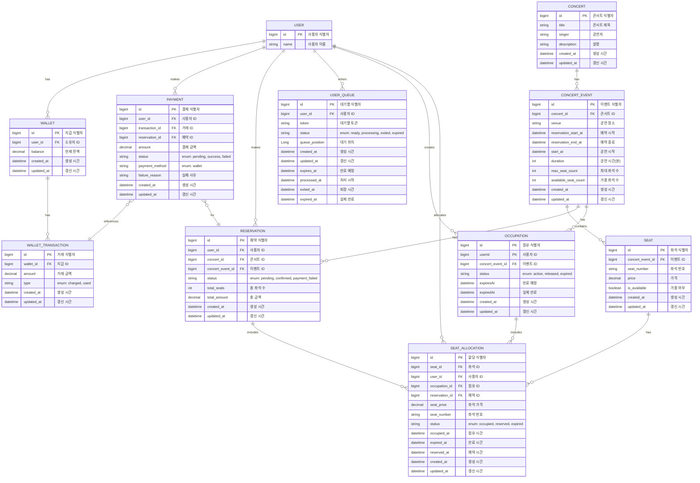

# 콘서트 좌석 예매 서비스 ERD

```mermaid
erDiagram
    USER ||--o{ WALLET: has
    USER ||--o{ PAYMENT: makes
    USER ||--o{ RESERVATION: makes
    USER ||--o{ USER_QUEUE: enters
    USER ||--o{ OCCUPATION: creates
    USER ||--o{ SEAT_ALLOCATION: allocates
    WALLET ||--o{ WALLET_TRANSACTION: has
    PAYMENT }o--|| WALLET_TRANSACTION: references
    PAYMENT }o--|| RESERVATION: for
    CONCERT ||--o{ CONCERT_EVENT: has
    CONCERT_EVENT ||--o{ SEAT: contains
    CONCERT_EVENT ||--o{ RESERVATION: has
    CONCERT_EVENT ||--o{ OCCUPATION: has
    SEAT ||--o{ SEAT_ALLOCATION: has
    OCCUPATION ||--o{ SEAT_ALLOCATION: includes
    RESERVATION ||--o{ SEAT_ALLOCATION: includes

    USER {
        bigint id PK "사용자 식별자"
        string name "사용자 이름"
    }

    WALLET {
        bigint id PK "지갑 식별자"
        bigint user_id FK "소유자 ID"
        decimal balance "현재 잔액"
        datetime created_at "생성 시간"
        datetime updated_at "갱신 시간"
    }

    WALLET_TRANSACTION {
        bigint id PK "거래 식별자"
        bigint wallet_id FK "지갑 ID"
        decimal amount "거래 금액"
        string type "enum: charged, used"
        datetime created_at "생성 시간"
        datetime updated_at "갱신 시간"
    }

    PAYMENT {
        bigint id PK "결제 식별자"
        bigint user_id FK "사용자 ID"
        bigint transaction_id FK "거래 ID"
        bigint reservation_id FK "예약 ID"
        decimal amount "결제 금액"
        string status "enum: pending, success, failed"
        string payment_method "enum: wallet"
        string failure_reason "실패 사유"
        datetime created_at "생성 시간"
        datetime updated_at "갱신 시간"
    }

    CONCERT {
        bigint id PK "콘서트 식별자"
        string title "콘서트 제목"
        string singer "공연자"
        string description "설명"
        datetime created_at "생성 시간"
        datetime updated_at "갱신 시간"
    }

    CONCERT_EVENT {
        bigint id PK "이벤트 식별자"
        bigint concert_id FK "콘서트 ID"
        string venue "공연 장소"
        datetime reservation_start_at "예약 시작"
        datetime reservation_end_at "예약 종료"
        datetime start_at "공연 시작"
        int duration "공연 시간(분)"
        int max_seat_count "최대 좌석 수"
        int available_seat_count "가용 좌석 수"
        datetime created_at "생성 시간"
        datetime updated_at "갱신 시간"
    }

    SEAT {
        bigint id PK "좌석 식별자"
        bigint concert_event_id FK "이벤트 ID"
        string seat_number "좌석 번호"
        decimal price "가격"
        boolean is_available "가용 여부"
        datetime created_at "생성 시간"
        datetime updated_at "갱신 시간"
    }

    SEAT_ALLOCATION {
        bigint id PK "할당 식별자"
        bigint seat_id FK "좌석 ID"
        bigint user_id FK "사용자 ID"
        bigint occupation_id FK "점유 ID"
        bigint reservation_id FK "예약 ID"
        decimal seat_price "좌석 가격"
        string seat_number "좌석 번호"
        string status "enum: occupied, reserved, expired"
        datetime occupied_at "점유 시간"
        datetime expired_at "만료 시간"
        datetime reserved_at "예약 시간"
        datetime created_at "생성 시간"
        datetime updated_at "갱신 시간"
    }

    OCCUPATION {
        bigint id PK "점유 식별자"
        bigint userId PK "사용자 ID"
        bigint concert_event_id FK "이벤트 ID"
        string status "enum: active, released, expired"
        datetime expiresAt "만료 예정"
        datetime expiredAt "실제 만료"
        datetime created_at "생성 시간"
        datetime updated_at "갱신 시간"
    }

    RESERVATION {
        bigint id PK "예약 식별자"
        bigint user_id FK "사용자 ID"
        bigint concert_id FK "콘서트 ID"
        bigint concert_event_id FK "이벤트 ID"
        string status "enum: pending, confirmed, payment_failed"
        int total_seats "총 좌석 수"
        decimal total_amount "총 금액"
        datetime created_at "생성 시간"
        datetime updated_at "갱신 시간"
    }

    USER_QUEUE {
        bigint id PK "대기열 식별자"
        bigint user_id FK "사용자 ID"
        string token "대기열 토큰"
        string status "enum: ready, processing, exited, expired"
        Long queue_position "대기 위치"
        datetime created_at "생성 시간"
        datetime updated_at "갱신 시간"
        datetime expires_at "만료 예정"
        datetime processed_at "처리 시작"
        datetime exited_at "퇴장 시간"
        datetime expired_at "실제 만료"
    }
```