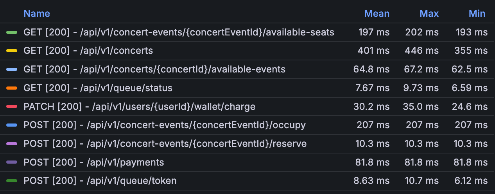
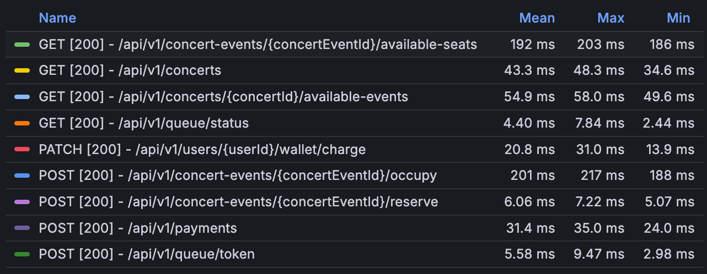

# 주요 시나리오에서의 Query

## 1. 콘서트 조회 API

<details>
<summary>SELECT Query</summary>
<div>

```sql
SELECT ce1_0.id,
       ce1_0.created_at,
       ce1_0.updated_at,
       ce1_0.description,
       ce1_0.singer,
       ce1_0.title
FROM concert ce1_0
```

</div>
</details>

- 단순 SELECT 쿼리로, 전체 콘서트 목록을 조회합니다.
- 대량 트래픽 시 성능 저하 가능성이 있습니다.

## 2. 한 콘서트의 예약 가능한 날짜 조회 API

<details>
<summary>SELECT Query</summary>
<div>

```sql
SELECT cee1_0.id,
       cee1_0.created_at,
       cee1_0.updated_at,
       cee1_0.available_seat_count,
       cee1_0.concert_id,
       cee1_0.duration,
       cee1_0.max_seat_count,
       cee1_0.reservation_end_at,
       cee1_0.reservation_start_at,
       cee1_0.start_at,
       cee1_0.venue
FROM concert_event cee1_0
WHERE cee1_0.concert_id = ?
  AND cee1_0.reservation_start_at < ?
  AND cee1_0.reservation_end_at > ?
```

</div>
</details>

- 특정 콘서트의 이벤트를 조회하는 쿼리입니다.
- WHERE 절에 인덱스를 적절히 사용하면 성능 개선이 가능합니다.

## 3. 예약 가능한 좌석 조회 API

<details>
<summary>SELECT Query</summary>
<div>

```sql
SELECT se1_0.id,
       se1_0.created_at,
       se1_0.updated_at,
       se1_0.concert_event_id,
       se1_0.is_available,
       se1_0.price,
       se1_0.seat_number
FROM seat se1_0
WHERE se1_0.concert_event_id = ?
  AND se1_0.is_available = 1 
```

</div>
</details>

- 특정 콘서트 이벤트의 가용 좌석을 조회하는 쿼리입니다.
- 대량의 좌석 데이터가 있을 경우 성능 저하 가능성이 있습니다.

## 4. 좌석 점유

<details>
<summary>SELECT Query</summary>
<div>

```sql
SELECT cee1_0.id,
       cee1_0.created_at,
       cee1_0.updated_at,
       cee1_0.available_seat_count,
       cee1_0.concert_id,
       cee1_0.duration,
       cee1_0.max_seat_count,
       cee1_0.reservation_end_at,
       cee1_0.reservation_start_at,
       cee1_0.start_at,
       cee1_0.venue
FROM concert_event cee1_0
WHERE cee1_0.id = ?
```
```sql
SELECT ce1_0.id,
       ce1_0.created_at,
       ce1_0.updated_at,
       ce1_0.description,
       ce1_0.singer,
       ce1_0.title
FROM concert ce1_0
WHERE ce1_0.id = ?
```
```sql            
SELECT se1_0.id,
       se1_0.created_at,
       se1_0.updated_at,
       se1_0.concert_event_id,
       se1_0.is_available,
       se1_0.price,
       se1_0.seat_number
FROM seat se1_0
WHERE se1_0.id IN (?)
  AND se1_0.is_available = 1
    FOR
UPDATE
```

</div>
</details>

## 5. 좌석 예약

<details>
<summary>SELECT Query</summary>
<div>

```sql
SELECT oe1_0.id,
       oe1_0.created_at,
       oe1_0.updated_at,
       oe1_0.concert_event_id,
       oe1_0.expired_at,
       oe1_0.expires_at,
       sa1_0.occupation_id,
       sa1_0.id,
       sa1_0.created_at,
       sa1_0.updated_at,
       sa1_0.expired_at,
       sa1_0.occupied_at,
       sa1_0.reservation_id,
       sa1_0.reserved_at,
       sa1_0.seat_id,
       sa1_0.seat_number,
       sa1_0.seat_price,
       sa1_0.status,
       sa1_0.user_id,
       oe1_0.status,
       oe1_0.user_id
FROM   occupation oe1_0
         LEFT JOIN seat_allocation sa1_0
                   ON oe1_0.id = sa1_0.occupation_id
WHERE  oe1_0.id = ?
  FOR UPDATE
```

</div>
</details>

- occupation 과 seat_allocation 테이블을 LEFT JOIN 하는 쿼리입니다.
- FOR UPDATE 구문으로 인한 Lock 경합 가능성이 있습니다.

## 6. 결제

<details>
<summary>SELECT Query</summary>
<div>

```sql
SELECT we1_0.id,
       we1_0.created_at,
       we1_0.updated_at,
       we1_0.balance,
       we1_0.user_id
FROM   wallet we1_0
WHERE  we1_0.user_id = ?
  FOR UPDATE
```
```sql
SELECT re1_0.id,
       re1_0.created_at,
       re1_0.updated_at,
       re1_0.concert_event_id,
       re1_0.concert_id,
       re1_0.status,
       re1_0.total_amount,
       re1_0.total_seats,
       re1_0.user_id
FROM   reservation re1_0
WHERE  re1_0.id = ?
FOR UPDATE
```
</div>
</details>

- 여러 테이블(wallet, reservation, user_queue)에 대한 개별 SELECT 쿼리로 구성되어 있습니다.
- 각 쿼리에 FOR UPDATE 구문이 포함되어 있어 Lock 경합 가능성이 있습니다.

# 각 Query 상황 별 Caching 적용 가능성 평가

## 콘서트 조회 API

- 콘서트 조회의 경우, 모든 User 가 최소 1번은 호출해야 하는 API 입니다.
- 또한 콘서트의 정보는 한번 공개되고 나면, 수정하는 빈도가 매우 낮을 것으로 예상됩니다.
- 그래서 대량 트래픽이 발생했을 때, 영향이 클 수 있습니다.
- 따라서 ***이 API 에 대해 Caching 을 적용하는 것이 성능 개선에 도움을 줄 것으로 예상됩니다.***

## 한 콘서트의 예약 가능한 날짜 조회 API

- 이 API 는 특정 콘서트의 예약 가능한 날짜 정보를 조회합니다.
- 콘서트의 예약 가능 날짜 정보는 자주 변경되지 않을 가능성이 높습니다.
- 많은 사용자가 동일한 콘서트의 예약 가능 날짜를 조회할 수 있어, 반복적인 쿼리가 실행 될 수 있습니다.
- 따라서 ***이 API 에 대해 Caching 을 적용하는 것이 성능 개선에 도움을 줄 것으로 예상됩니다.***

## 예약 가능한 좌석 조회 API

- 예약 가능한 좌석 조회 API 는 사용자가 좌석을 선택하기 위해 빈번하게 호출하는 API 입니다.
- 실시간으로 좌석 상태가 변경되므로, 데이터의 정확성과 실시간성이 매우 중요합니다.
- Caching 을 적용할 경우 실시간 데이터와의 불일치 문제가 발생할 수 있어, 이 API 에는 Caching 이 적합하지 않습니다.

## 좌석 점유 및 예약 관련 쿼리

- 좌석 점유 및 예약 관련 쿼리는 실시간 데이터의 정확성이 매우 중요합니다.
- 이러한 작업은 데이터베이스의 일관성을 유지해야 하며, 최신 상태를 반영해야 합니다.
- 따라서 이 부분에 대해서는 Caching 을 적용하는 것이 적합하지 않습니다.

## 결제 관련 쿼리

- 각 쿼리에는 FOR UPDATE 구문이 포함되어 있어, 데이터의 일관성과 정확성이 중요힙니다.
- 결제는 실시간으로 정확한 데이터를 필요로 하는 중요한 트랜잭션입니다.
- 결제 관련 데이터는 자주 변경될 수 있으며, 항상 최신 상태를 유지해야 합니다.
- 따라서 이 부분에 대해서는 Caching 을 적용하는 것이 적합하지 않습니다.

# 개선 전 부하 테스트 결과 및 분석

- k6 를 사용하여 부하 테스트를 진행하였으며, Grafana 로 서버 상태를 모니터링했습니다.

<details>
<summary>부하 테스트 스크립트</summary>
<div>

```js

// ... 다른 로직 생략 ...

export const errorRate = new Rate('errors');

export const options = {
    stages: [
        {duration: '1m', target: 10},
    ],
    thresholds: {
        'http_req_duration': ['p(95)<500'],
        'errors': ['rate<0.1']
    }
}

export default function () {
    const userId = getRandomUserId();

    // 잔액 충전
    requestChargeWallet(userId, 100000);
    sleep(1);

    // 토큰 발급
    const token = requestGenToken(userId);
    sleep(1);

    // 토큰이 활성 상태가 될 때까지 기다림
    requestUntilTokenIsActive(token);
    sleep(1);

    // 콘서트 목록 조회
    const concert = requestConcerts(token);
    sleep(1);

    // 해당 콘서트에서 예약 가능한 콘서트 이벤트 조회
    const concertEvent = requestConcertEvents(concert.id, token);
    sleep(1);

    let occupation = null;
    let attemptCount = 0;

    // 다른 사람이 먼저 점유할 수 있어, 재시도를 진행
    while (!occupation && attemptCount < MAX_OCCUPY_ATTEMPTS) {
        // 해당 콘서트 이벤트에서 예약 가능한 좌석 조회
        const seat = requestAvailableSeats(concertEvent.id, token);
        if (seat === null) {
            console.log("모든 좌석이 예약된 콘서트 이벤트로 테스트 종료.");
            return;
        }
        sleep(1);

        // 예약 가능한 좌석에 대해서 점유 시도
        occupation = requestOccupySeat(concertEvent.id, seat.id, token);
        if (!occupation) {
            console.log(`좌석 점유 실패. 다시 시도 (시도 횟수: ${attemptCount + 1})`);
            sleep(1);  // 재시도 전 잠시 대기
        }
        attemptCount++;
    }

    if (!occupation) {
        console.log("모든 좌석 점유 시도 실패. 테스트를 종료");
        return;
    }

    // 점유한 좌석에 대해서 예약
    const reservation = requestReserveSeat(concertEvent.id, occupation.id, token);
    sleep(1);

    // 예약에 대해 결제
    requestPayReservation(reservation.id, token);
}
```

</div>
</details>

- 테스트 구성
    - 최대 가상 사용자(VUs): 10
    - 반복 횟수: 10

## 테스트 결과

- k6 부하 테스트 결과

```

     checks.........................: 100.00% ✓ 200      ✗ 0
     data_received..................: 39 MB   531 kB/s
     data_sent......................: 74 kB   1.0 kB/s
   ✓ errors.........................: 0.00%   ✓ 0        ✗ 0
     http_req_blocked...............: avg=41.38µs min=2µs    med=10µs    max=1ms      p(90)=15.1µs   p(95)=25.99µs
     http_req_connecting............: avg=24.85µs min=0s     med=0s      max=852µs    p(90)=0s       p(95)=0s
   ✓ http_req_duration..............: avg=47.36ms min=1.92ms med=11.46ms max=597.23ms p(90)=187.07ms p(95)=219.46ms
       { expected_response:true }...: avg=47.36ms min=1.92ms med=11.46ms max=597.23ms p(90)=187.07ms p(95)=219.46ms
     http_req_failed................: 0.00%   ✓ 0        ✗ 200
     http_req_receiving.............: avg=711.9µs min=18µs   med=100µs   max=19.51ms  p(90)=165.4µs  p(95)=739.24µs
     http_req_sending...............: avg=60.23µs min=16µs   med=56.5µs  max=196µs    p(90)=86µs     p(95)=118.04µs
     http_req_tls_handshaking.......: avg=0s      min=0s     med=0s      max=0s       p(90)=0s       p(95)=0s
     http_req_waiting...............: avg=46.59ms min=1.88ms med=11.24ms max=577.62ms p(90)=186.94ms p(95)=218.41ms
     http_reqs......................: 200     2.730111/s
     iteration_duration.............: avg=41.01s  min=11.05s med=41.1s   max=1m5s     p(90)=1m2s     p(95)=1m3s
     iterations.....................: 10      0.136506/s
     vus............................: 2       min=1      max=9
     vus_max........................: 10      min=10     max=10
```

- Grafana 에서 측정한 API 별 응답 시간



## 결과 분석

- 총 요청 수: 200
- 응답 시간 (http_req_duration)
    - 평균: 47.36ms
    - 중앙값: 11.46ms
    - 최대값: 597.23ms
    - 95번째 백분위수: 219.46ms
- 초당 요청 수 (http_reqs): 2.730111/s
- 반복 지속 시간 (iteration_duration)
    - 평균: 41.01s
    - 최대값: 1m5s
- 평균 응답 시간이 50ms 미만으로 양호한 편이지만, 최대값이 597.23ms로 높은 편입니다. 일부 요청에서 지연이 발생한 것으로 볼 수 있습니다.
- 한 번의 전체 예약 프로세스(잔액 충전부터 결제까지)가 평균 41초 정도 소요되고 있습니다. 최대값이 1분 5초로, 일부 케이스에서 지연이 발생하고 있습니다.
- `GET /api/v1/concerts` 에서 평균 401ms로 가장 긴 응답 시간을 보이고 있습니다.
- `GET /api/v1/concert-events/{concertEventId}/available-seats` 에서 평균 197ms로 두 번째로 긴 응답 시간을 보이지만, 실시간 데이터의 정확성이 중요하므로
  캐싱이외의 다른 방법으로 개선 해야할 것 같습니다.
- `POST /api/v1/concert-events/{concertEventId}/occupy` 에서 평균 207ms로 세 번째로 긴 응답 시간을 보입니다. 이는 좌석 점유 과정에서의 데이터베이스 작업 때문으로
  보입니다.
- `GET /api/v1/concerts/{concertId}/available-events` 에서 평균 64.8ms로 중간 정도의 응답 시간을 보입니다.
- `POST /api/v1/payments` 에서 평균 81.8ms로 비교적 긴 응답 시간을 보이지만, 결제 처리의 특성상 캐싱보다는 다른 최적화 방법을 고려해야 할 것 같습니다.
- 나머지 API들(queue 관련, wallet charge, reserve)은 상대적으로 빠른 응답 시간(10ms 내외)을 보이고 있습니다.

# Caching 적용 후 부하 테스트 결과 및 분석

- k6 부하 테스트 결과

```
   checks.........................: 100.00% ✓ 302      ✗ 0
   data_received..................: 113 MB  1.6 MB/s
   data_sent......................: 110 kB  1.6 kB/s
 ✓ errors.........................: 0.00%   ✓ 0        ✗ 0
   http_req_blocked...............: avg=33.3µs  min=2µs    med=10µs    max=1.06ms   p(90)=17µs     p(95)=46.94µs
   http_req_connecting............: avg=16.99µs min=0s     med=0s      max=844µs    p(90)=0s       p(95)=0s
 ✓ http_req_duration..............: avg=55.43ms min=1.61ms med=18.49ms max=225.34ms p(90)=195.77ms p(95)=204.45ms
     { expected_response:true }...: avg=55.43ms min=1.61ms med=18.49ms max=225.34ms p(90)=195.77ms p(95)=204.45ms
   http_req_failed................: 0.00%   ✓ 0        ✗ 302
   http_req_receiving.............: avg=1.25ms  min=26µs   med=86µs    max=19.67ms  p(90)=299.4µs  p(95)=10.25ms
   http_req_sending...............: avg=62.28µs min=17µs   med=53.5µs  max=514µs    p(90)=103.9µs  p(95)=124.84µs
   http_req_tls_handshaking.......: avg=0s      min=0s     med=0s      max=0s       p(90)=0s       p(95)=0s
   http_req_waiting...............: avg=54.12ms min=1.53ms med=18.34ms max=225.13ms p(90)=195.63ms p(95)=204.25ms
   http_reqs......................: 302     4.406714/s
   iteration_duration.............: avg=11.87s  min=7.58s  med=10.68s  max=13.77s   p(90)=13.66s   p(95)=13.68s
   iterations.....................: 29      0.423161/s
   vus............................: 2       min=1      max=9
   vus_max........................: 10      min=10     max=10
```

- Grafana 에서 측정한 API 별 응답 시간



## 결과 분석

- 총 요청 수: 302
- 응답 시간 (http_req_duration):
    - 평균: 55.43ms
    - 중앙값: 18.49ms
    - 최대값: 225.34ms
    - 95번째 백분위수: 204.45ms
- 초당 요청 수 (http_reqs): 4.406714/s
- 반복 지속 시간 (iteration_duration):
    - 평균: 11.87s
    - 최대값: 13.77s
- `GET /api/v1/concerts` 평균 43.3ms로 큰 폭으로 개선되었습니다. (이전 401ms)
- `GET /api/v1/concert-events/{concertEventId}/available-seats` 평균 192ms로 약간 개선되었으나, 미미한 수준입니다. (이전 197ms)
- `GET /api/v1/concerts/{concertId}/available-events` 평균 54.9ms로 약간 개선되었습니다 (이전 64.8ms)
- `POST /api/v1/concert-events/{concertEventId}/occupy` 평균 201ms로 거의 약간 개선되었으나, 미미한 수준입니다. (이전 207ms)
- `POST /api/v1/payments` 평균 31.4ms로 크게 개선되었습니다 (이전 81.8ms).
- 나머지 API들은 대부분 비슷한 수준을 유지하고 있습니다.

## Caching 적용 전후 비교 및 결론

- 평균 응답 시간이 47.36ms 에서 55.43ms 로 약간 증가했지만, 이는 더 많은 요청을 처리했기 때문에 일어난 현상 같습니다.
- 초당 요청 처리량이 2.73에서 4.41로 크게 증가했습니다. 이 지표가 시스템의 전반적인 처리 능력이 향상되었음을 나타내는 지표라고 생각합니다.
- 전체 프로세스 시간(iteration_duration)이 평균 41초에서 11.87초로 크게 단축되었습니다. UX 면에서 큰 개선이라고 볼 수 있습니다.
- 콘서트 목록 조회(`GET /api/v1/concerts`) API 의 응답 시간이 401ms 에서 43.3ms 로 약 89% 개선되었습니다. 캐싱 적용을 함으로써 개선이되었다고 볼 수 있습니다.
- 콘서트 이벤트 조회(`GET /api/v1/concerts/{concertId}/available-events`) API 도 64.8ms 에서 54.9ms 로 약 15% 개선되었습니다.
- 결론적으로, 캐싱 적용은 전반적인 시스템 성능을 크게 향상시켰습니다. 특히 콘서트 목록 조회 API 의 획기적인 개선은 사용자 경험을 크게 향상시킬 것으로 예상됩니다. 다만, 실시간 데이터의 정확성이 중요한
  API 들은 제한적인 개선을 보였습니다. 앞으로 추가적인 성능 개선을 위해서는 데이터베이스 쿼리 최적화, 인덱싱 개선 등을 진행할 수 있을 것 같습니다.