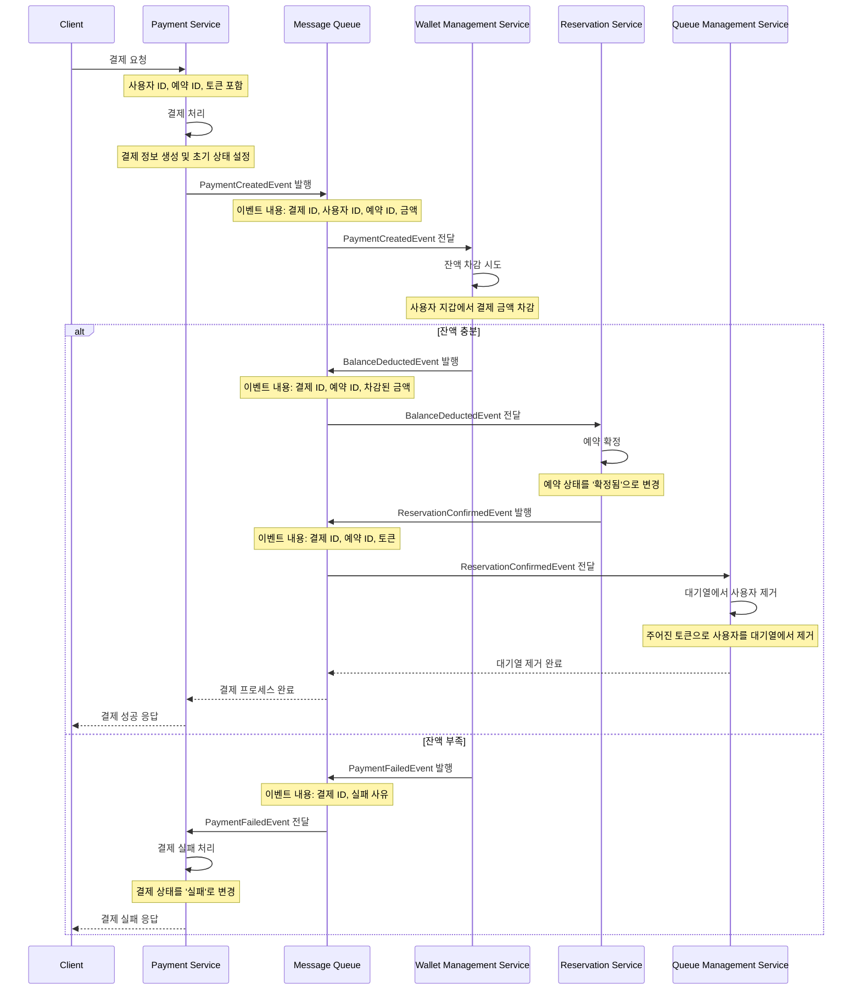

# 목차

- [좌석 예약 UseCase 의 논리적 트랜잭션 범위와 물리적 트랜잭션 범위](#좌석-예약-usecase-의-논리적-트랜잭션-범위와-물리적-트랜잭션-범위)
    - [OccupySeatUseCase 구현체](#occupyseatusecase-구현체)
    - [논리적 트랜잭션](#논리적-트랜잭션)
    - [물리적 트랜잭션](#물리적-트랜잭션)
    - [분석](#분석)
- [결제 UseCase 의 논리적 트랜잭션 범위와 물리적 트랜잭션 범위](#결제-usecase-의-논리적-트랜잭션-범위와-물리적-트랜잭션-범위)
    - [PayUseCase 구현체](#payusecase-구현체)
    - [논리적 트랜잭션 범위](#논리적-트랜잭션-1)
    - [물리적 트랜잭션 범위](#물리적-트랜잭션-1)
    - [분석](#분석-1)
- [MSA 구성 방식](#msa-구성-방식)
- [MSA 적용시 트랜잭션 관점에서의 문제점 및 해결 방안](#msa-적용시-트랜잭션-관점에서의-문제점-및-해결-방안)
    - [좌석 예약 UseCase](#좌석-예약-usecase)
        - [문제점](#문제점)
        - [해결방안](#해결방안)
    - [결제 UseCase](#결제-usecase)
        - [문제점](#문제점-1)
        - [해결방안](#해결방안-1)

---

# 좌석 예약 UseCase 의 논리적 트랜잭션 범위와 물리적 트랜잭션 범위

## OccupySeatUseCase 구현체

```kotlin
@Component
class OccupySeatUseCaseImpl(
    private val concertService: ConcertService,
    private val occupationService: OccupationService,
    private val distributedLockService: DistributedLockService,
    private val lockKeyGenerator: LockKeyGenerator,
) : OccupySeatUseCase {

    override fun execute(
        userId: Long,
        concertEventId: Long,
        seatId: Long,
    ): OccupationResult {
        // 1. 콘서트 이벤트가 예약 기간인지 확인
        val now = ZonedDateTime.now().asUtc
        val concertEvent = concertService.getConcertEvent(concertEventId)
        concertEvent.verifyWithinReservationPeriod(now)

        // 2. seatId 를 가지는 좌석에 대해 점유
        val seatIds = listOf(seatId)
        val occupation =
            distributedLockService.withLock(lockKeyGenerator.generateConcertEventSeatKey(concertEvent, seatId)) {
                occupationService.occupy(userId, concertEventId, seatIds)
            } ?: throw SeatUnavailableException()

        // 3. 콘서트 이벤트의 예약 가능한 좌석 수 업데이트
        concertService.refreshAvailableSeats(concertEventId)
        return OccupationResult.from(occupation)
    }
}
```

## 논리적 트랜잭션

- 좌석 예약은, 비지니스 관점에서 봤을 때, 아래의 작업이 원자적으로 실행되어야 합니다.
    1. 현재 예약 기간인 콘서트 이벤트
    2. 좌석 점유
- 한 단계라도 실패하면, 전체 작업이 취소되어야 합니다.

## 물리적 트랜잭션

- 현재 구현 상으로 각 Service 의 메소드마다 `@Transactional` 이 아래와 같이 적용되어있습니다.
    - `@Transactional(readOnly = true) concertService.getConcertEvent(concertEventId)`
    - `@Transactional(propagation = Propagation.REQUIRES_NEW) occupationService.occupy(userId, concertEventId, seatIds)`
    - `@Transactional concertService.refreshAvailableSeats(concertEventId)`
- 즉, 각 Service 의 메소드 호출마다 별도의 트랜잭션이 시작되고 종료됩니다.

## 분석

- 논리적으로는 두 단계가 원자적으로 실행되어야 하지만, 물리적으로는 별도의 트랜잭션으로 실행되고 있습니다.
- 현재 구현은 논리적 트랜잭션과 물리적 트랜잭션이 정확히 일치하지는 않지만, `getConcertEvent`가 읽기 전용 작업이므로 별도의 트랜잭션으로 실행되어도 데이터 일관성에 문제가 없을 것으로 생각됩니다.
- `occupy` 메소드가 의 트랜잭션으로 실행되므로 좌석 점유의 원자성이 보장됩니다. 이러한 구조는 성능과 데이터 일관성 사이의 균형을 잘 유지하고 있습니다.
- `occupationService.occupy()` 메소드가 새로운 트랜잭션으로 실행되는 시점에, 이론적으로는 `ConcertEvent`의 상태가 변경될 수 있는 가능성이 있습니다. 예를
  들어, `getConcertEvent()` 메소드 실행 직후와 `occupy()` 메소드 실행 직전 사이에 `ConcertEvent`의 예약 기간이 종료되는 상황을 생각해 볼 수 있습니다. 그러나 이는 다음과
  같은 이유로 좌석 예약 프로세스에 있어 큰 문제가 되지 않는 매우 희박한 엣지 케이스로 간주할 수 있습니다.
    - `getConcertEvent()`와 `occupy()` 메소드 실행 사이의 시간 간격이 매우 짧기 때문에, 이 짧은 시간 동안 `ConcertEvent`의 상태가 변경될 확률은 극히 낮습니다.
    - 사용자가 예약 마감 직전에 예약을 시도하는 경우, 시스템의 처리 시간으로 인해 예약이 실패할 수 있다는 것은 일반적으로 수용 가능한 시나리오입니다.
- 따라서, 이러한 엣지 케이스는 시스템의 전반적인 동작과 신뢰성에 미치는 영향이 미미하며, 추가적인 복잡성을 도입하여 처리하기보다는 현재의 구현으로도 충분히 안정적인 운영이 가능하다고 판단됩니다.

# 결제 UseCase 의 논리적 트랜잭션 범위와 물리적 트랜잭션 범위

## PayUseCase 구현체

```kotlin

@Component
class PayUseCaseImpl(
    private val reservationService: ReservationService,
    private val walletService: WalletService,
    private val paymentService: PaymentService,
    private val queueService: QueueService,
) : PayUseCase {
    override fun execute(
        userId: Long,
        token: String,
        reservationId: Long,
    ): PaymentResult {
        // 1. reservation 가져오기 및 검증
        val reservation = reservationService.getReservation(reservationId)
        reservation.verifyStatusIsNotConfirmed()

        // 2. 결제 시도
        var transaction: Transaction? = null
        var failureReason: String? = null
        runCatching {
            walletService.pay(userId, reservation.totalAmount)
        }.onSuccess {
            transaction = it
        }.onFailure { exception ->
            failureReason =
                if (exception is TicketingException) {
                    exception.errorCode.message
                } else {
                    exception.localizedMessage
                }
        }

        // 3. 결제 결과로 내역 만들기
        val payment = paymentService.create(userId, reservation.id, transaction?.id, failureReason)

        // 4. reservation 의 상태를 완료로 변경
        reservationService.confirm(reservation.id)

        // 5. queue 에서 entry 제거
        queueService.exit(token)

        return PaymentResult.from(payment)
    }
}

```

## 논리적 트랜잭션

- 결제는, 비지니스 관점에서 봤을 때, 아래의 작업이 원자적으로 그리고 순차적으로 실행되어야 합니다.
    1. 예약 정보 조회
    2. 결제 시도
    3. 결제 내역 생성
    4. 예약 상태 확정
    5. 대기열에서 사용자 제거

## 물리적 트랜잭션

- 현재 구현 상으로 각 Service 의 메소드마다 `@Transactional` 이 아래와 같이 적용되어있습니다.
    - `@Transactional(readOnly = true) reservationService.getReservation(reservationId)`
    - `@Transactional walletService.pay(userId, reservation.totalAmount)`
    - `@Transactional paymentService.create(userId, reservation.id, transaction?.id, failureReason)`
    - `@Transactional reservationService.confirm(reservation.id)`
- `QueueService` 의 구현체는 Redis 를 이용해서 구현이 되어있기 때문에, 별도의 트랜잭션 없이 원자적으로 실행됩니다.
- `reservationService.getReservation()` 을 제외한 3개의 메소드는 기본 Propagation 설정에 따라 한 Transaction 으로 실행됩니다.

## 분석

- 논리적으로는 5개의 단계가 원자적으로 실행되어야 하지만, 물리적으로는 2개의 별도 트랜잭션과 1개의 원자적 작업으로 나뉘어 실행됩니다.
    - 첫 번째 트랜잭션: `reservationService.getReservation()`은 읽기 전용 트랜잭션으로 별도로 실행됩니다.
    - 두 번째 트랜잭션: `walletService.pay()`, `paymentService.create()`, `reservationService.confirm()`이 하나의 트랜잭션으로 묶여 실행됩니다.
    - 별도의 원자적 작업: `QueueService`의 `exit()` 메소드는 Redis를 이용하여 별도의 원자적 작업으로 실행됩니다.
- `reservationService.getReservation()`이 읽기 전용 트랜잭션으로 분리된 것은 성능 최적화 측면에서 적절한 선택이지만, 예약 정보 조회와 실제 결제 처리 사이에 시간 간격이 발생할 수
  있어, 데이터 일관성 문제가 발생할 수 있습니다.
- 두 번째 트랜잭션 내에서 결제는 성공했지만 예약 상태 변경에 실패하는 경우, 전체 트랜잭션이 롤백되어 결제가 취소됩니다.
- `QueueService.exit()` 메소드가 별도의 원자적 작업으로 실행되는 것은, 결제 처리와 대기열 관리의 관심사를 분리할 수 있지만, 실패하더라도 대기열에서 사용자가 제거될 수 있습니다.

# MSA 구성 방식

- 이전에 작성한 [도메인 모델](https://github.com/yuiyeong/ticketing-service/blob/main/docs/domain_models.md) 문서의 바운디드 컨테스트는 아래와
  같습니다.
    - 사용자 관리 컨텍스트
    - 잔액 관리 컨텍스트
    - 콘서트 관리 컨텍스트
    - 예약 및 점유 관리 컨텍스트
    - 결제 컨텍스트
- 이 바운디드 컨텍스트를 바탕으로, 아래와 같이 독립적인 마이크로 서비스로 를 분리할 수 있습니다.
    1. 사용자 관리 서비스 (`User Management Service`)
        - 사용자 정보 관리
    2. 잔액 관리 서비스 (`Wallet Management Service`)
        - 사용자 지갑 관리
        - 잔액 조회, 충전, 사용 처리
        - 트랜잭션 기록 관리
    3. 콘서트 관리 서비스 (`Concert Management Service`)
        - 콘서트 정보 관리
        - 콘서트 이벤트 관리
        - 좌석 정보 관리
    4. 예약 및 점유 관리 서비스 (`Reservation Service`)
        - 좌석 예약 처리
        - 좌석 임시 점유 관리
        - 예약 상태 관리
    5. 결제 서비스 (`Payment Service`)
        - 결제 처리
        - 결제 내역 관리
    6. 대기열 관리 서비스 (`Queue Management Service`)
        - 대기열 생성 및 관리
        - 대기열 토큰 발급 및 관리

# MSA 적용시 트랜잭션 관점에서의 문제점 및 해결 방안

## 좌석 예약 UseCase

### 문제점

- 콘서트 이벤트 정보(`Concert Management Service`)와 좌석 점유 정보(`Reservation Service`)가 서로 다른 서비스에 분산되어 있습니다.
- 이러한 분산 환경에 의해 콘서트 이벤트 확인과 좌석 점유 사이에 시간 간격이 발생할 수 있으며, 그 사이에 데이터가 변경될 가능성이 있습니다.
- 또한 좌석 점유는 성공했지만 콘서트 이벤트 정보 업데이트에 실패할 경우, 두 서비스 간 데이터 불일치가 발생할 수 있습니다.
- 결국 비즈니스 트랜잭션 보장 관점에서 보면, 좌석 예약이라는 하나의 비즈니스 트랜잭션이 여러 서비스에 걸쳐 있어, 전체 과정의 원자성을 보장하기 어렵습니다.

### 해결방안

- Saga 패턴의 코레오그래피 방식을 이용하여, 비즈니스 트랜잭션의 일관성을 최대한 보장하도록 할 수 있습니다.
- 이 과정에서 일시적인 데이터 불일치 상태가 있지만, 최종적으로는 일관성을 유지할 수 있습니다.
- 사용하는 이벤트
    - `SeatOccupiedEvent`: 좌석이 성공적으로 점유되었음을 알리는 이벤트입니다. 이를 통해 `Concert Management Service` 가 해당 콘서트 이벤트의 가용성을 확인하고 업데이트할
      수 있습니다.
    - `SeatOccupationCompensationEvent`: 좌석 점유를 취소해야 할 때 발행되는 이벤트입니다. 예약 기간이 아닌 경우 등 비즈니스 규칙 위반 시 발생합니다.
- Saga 패턴 사용시 시퀀스 다이어그램

    ```mermaid
    sequenceDiagram
        participant Client
        participant RS as Reservation Service
        participant MQ as Message Queue
        participant CMS as Concert Management Service
    
        Client->>RS: 좌석 예약 요청
        Note over RS: 사용자 ID, 콘서트 이벤트 ID, 좌석 ID 포함
        RS->>RS: 좌석 점유 시도
        Note over RS: 좌석의 가용성 확인 및 임시 점유 처리
        RS->>MQ: SeatOccupiedEvent 발행
        Note over MQ: 이벤트 내용: 점유 ID, 콘서트 이벤트 ID, 좌석 ID
        MQ->>CMS: SeatOccupiedEvent 전달
        CMS->>CMS: 예약 기간 확인
        Note over CMS: 현재 시간이 예약 가능 기간 내인지 검증
        alt 예약 기간 내
            CMS->>CMS: 가용 좌석 수 업데이트
            Note over CMS: 해당 콘서트 이벤트의 가용 좌석 수 감소
            CMS-->>MQ: 업데이트 완료
            MQ-->>RS: 업데이트 완료 알림
            RS-->>Client: 예약 성공 응답
        else 예약 기간 외
            CMS->>MQ: SeatOccupationCompensationEvent 발행
            Note over MQ: 이벤트 내용: 점유 ID, 취소 사유
            MQ->>RS: SeatOccupationCompensationEvent 전달
            RS->>RS: 좌석 점유 취소
            Note over RS: 임시 점유 상태 해제
            RS-->>Client: 예약 실패 응답
        end
    ```

## 결제 UseCase

### 문제점

- 여러 서비스(`Reservation Service`, `Wallet Management Service`, `Payment Service`, `Queue Management Service`)에 걸쳐 있는 작업들을
  원자적으로 실행하기 어렵습니다.
- 결제 처리(`Payment Service`), 잔액 차감(`Wallet Management Service`), 예약 확정(`Reservation Service`), 대기열
  제거(`Queue Management Service`) 등 여러 서비스의 데이터가 동시에 변경되어야 합니다.
- 각 서비스가 독립적으로 동작하므로, 모든 서비스의 데이터 변경을 아우르는 글로벌 트랜잭션을 사용할 수 없습니다.
- 한 서비스의 작업은 성공했지만 다른 서비스의 작업이 실패할 경우, 전체 시스템의 데이터 일관성을 유지하기 위한 복잡한 보상 트랜잭션이 필요합니다.

### 해결방안

- Saga 패턴의 코레오그래피 방식을 이용하여, 비즈니스 트랜잭션의 일관성을 최대한 보장하도록 할 수 있습니다.
- 이 과정에서 일시적인 데이터 불일치 상태가 있지만, 최종적으로는 데이터의 일관성을 유지할 수 있습니다.
- 사용하는 이벤트
    - `PaymentCreatedEvent`: 결제 처리가 시작되었음을 알리는 이벤트입니다. 이를 통해 `Wallet Management Service`가 잔액 차감을 시도합니다.
    - `BalanceDeductedEvent`: 사용자의 지갑에서 금액이 성공적으로 차감되었음을 알리는 이벤트입니다. 이를 통해 `Reservation Service`가 예약을 확정할 수 있습니다.
    - `ReservationConfirmedEvent`: 예약이 확정되었음을 알리는 이벤트입니다. 이를 통해 `Queue Management Service`가 사용자를 대기열에서 제거할 수 있습니다.
    - `PaymentFailedEvent`: 결제가 실패했음을 알리는 이벤트입니다. 잔액 부족 등의 이유로 발생할 수 있으며, 이를 통해 `Payment Service`가 결제 실패 처리를 할 수 있습니다.


