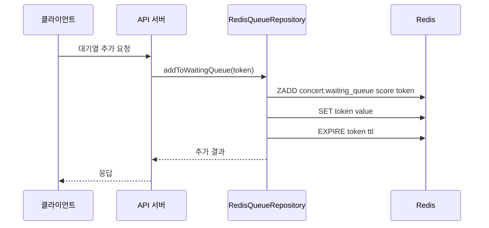
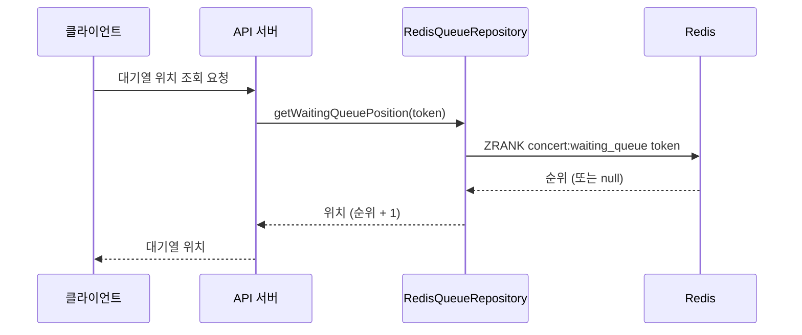
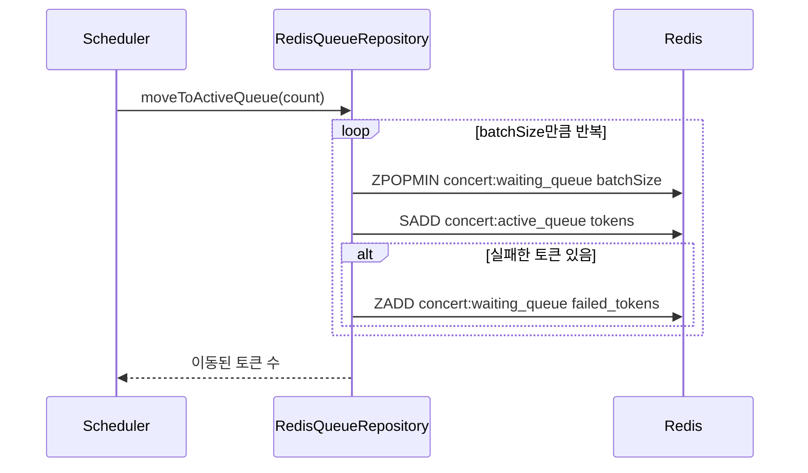
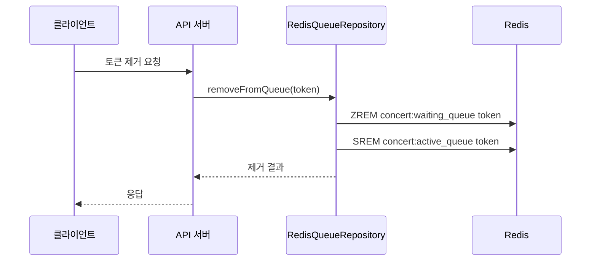
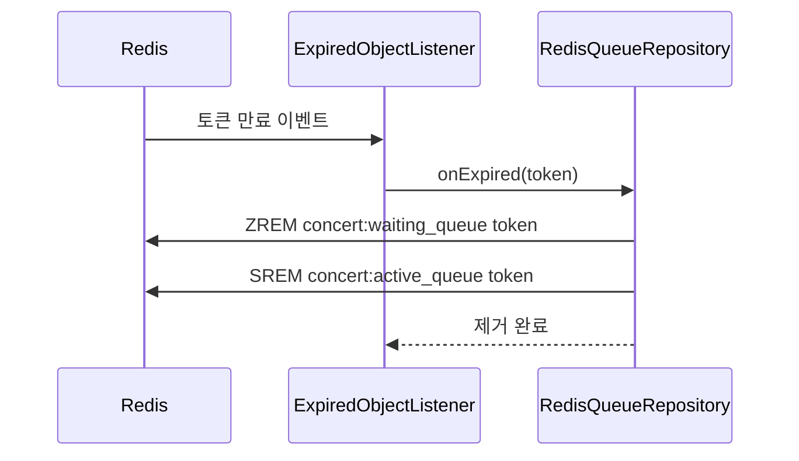

# 대기열 시스템을 Redis 를 이용해서 구현하기

## 데이터 구조

- 대기 큐: Sorted Set (key: "concert:waiting_queue")
- 활성 큐: Set (key: "concert:active_queue")
- 토큰 TTL 추적: String (key: [token])

## 대기열 추가

1. 토큰을 대기 큐(Sorted Set)에 추가 (score: 현재 시간)
2. 토큰에 대한 TTL 설정 및 만료 리스너 등록

## 대기열 위치 조회

- 대기 큐에서 토큰의 rank 조회

## 활성 큐로 이동

1. 대기 큐에서 지정된 수만큼의 토큰을 가져옴
2. 가져온 토큰을 활성 큐(Set)에 추가
3. 실패한 토큰은 대기 큐로 다시 추가

## 토큰 제거

1. 대기 큐 및 활성 큐에서 토큰 제거

## 토큰 만료 처리

1. 만료 이벤트 수신
    1. 이벤트를 수신하기 위해, redis server 에서 아래 명령어를 실행해준다.
       `redis-server --notify-keyspace-events KEA`
2. 대기 큐 및 활성 큐에서 만료된 토큰 제거

## 어떤 주기로 몇 개의 Token 을 대기 큐에서 활성 큐로 옮겨야 할까?

### 아래 수식을 바탕으로 토큰 활성화 주기와 토큰 수를 계산

1. 동시 처리 가능 사용자 수 = (최대 처리량 * 평균 세션 지속 시간) / (평균 API 호출 횟수 * (1 + 실패율))
2. 토큰 활성화 주기 = 평균 세션 지속 시간 / (목표 동시 접속자 수 / 동시 처리 가능 사용자 수)
3. 활성화할 토큰 수 = (최대 처리량 * 토큰 활성화 주기) / (평균 API 호출 횟수 * (1 + 실패율))

### 가정치

- 최대 처리량: 약 1,000 TPS 라고 가정
- 유저가 콘서트 조회부터 예약을 완료할 때까지 걸리는 평균 시간: 약 5분 이라고 가정
- 평균 API 호출 횟수: 약 6개
    - 콘서트 조회 API
    - 콘서트 이벤트 조회API
    - 콘서트 좌석을 조회하는 API
    - 좌석 점유 API
    - 예약 API
    - 결제 API
- 실패율: 15%라고 가정 (동시성 이슈 등으로 인한 실패 가능성 고려)

### 계산 과정

- 동시 처리 가능 사용자 수
    - (최대 처리량 * 평균 세션 지속 시간) / (평균 API 호출 횟수 * (1 + 실패율))
      = (1,000(TPS) * 300(초)) / (6(개) * (1 + 0.15))
      = 300,000 / 6.9
      ≈ 43,478 명
    - 보수적으로 잡아서 `약 40,000 명` 동시 처리 가능
- 토큰 활성화 주기 계산
    - 목표 동시 접속자 수를 동시 처리 가능 사용자 수의 80% 라고 가정
    - 목표 동시 접속자 수 = 40,000 명 * 0.8 = 32,000명
    - 평균 세션 지속 시간 / (목표 동시 접속자 수 / 동시 처리 가능 사용자 수)
      = 300(초) / (32,000(명) / 40,000(명))
      = 300 * **1.25**
      = 375초
    - 보수적으로 잡아서 `약 6분`
- 활성화할 토큰 수 계산
  (최대 처리량 * 토큰 활성화 주기) / (평균 API 호출 횟수 * (1 + 실패율))
  = (1,000 * 375) / (6 * (1 + 0.15))
  = 375,000 / 6.9
  ≈ 54,348 개
    - 보수적으로 잡아서 `약 50,000개`
- 결론
    - 6분마다 50,000개 를 활성 큐로 옮기면 된다.
    - 즉, 1분마다면  8,334 개를, 10초마다면, **1389 개 를 옮기면 된다.**
    - UX 적인 면을 고려해서 아래와 같이 결정
        - **활성화 주기: 10초**
        - **활성화할 토큰 수: 1400 개**
    - 예상 대기 시간 계산식(N: 활성화 주기, M: 활성화할 토큰 수)
        - **대기 시간 (초) = ceil(대기 순번 / M) * N**