# 콘서트 좌석 예약 서비스 시나리오 및 시퀀스 다이어그램

## 전제 조건

- 사용자는 이미 회원가입이 완료되어 있음
- 사용자는 서비스에 로그인한 상태임
- `잔액 관리`와 `User token 발급 API`를 제외한 나머지 시나리오에서는, User token 발급 API 로부터 받은 token 과 함께 API 를 호출한다.

## 1. 대기열 진입

### 1.1. 사용자가 User Token 발급 API 를 호출

- 1.1.1 대기열에 첫 진입일 경우, 새 Token 을 발행하고 User 를 대기열에 추가한 뒤, token 정보와 예상 대기 시간을 내려준다.
- 1.2.1 이미 Token 을 발급받았었고 대기열에 있는 경우, 아래 작업을 한 뒤, token 정보와 갱신된 예상 대기 시간을 내려준다.
    - 이전 Token 을 만료시키면서 대기열에서 제외
    - Token 을 재발행

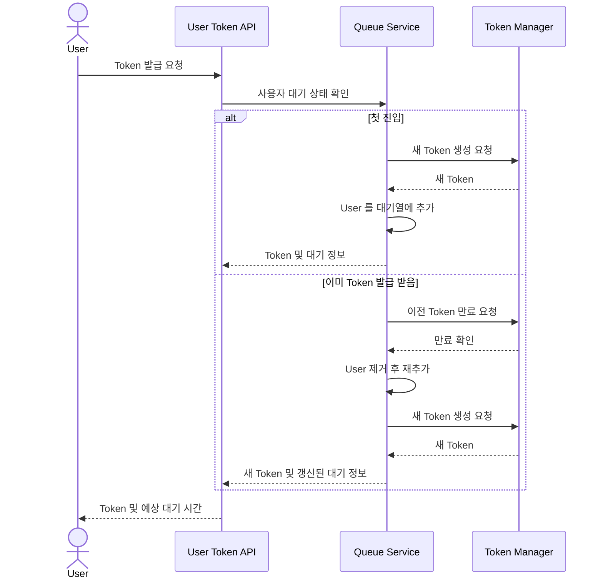

## 2. 대기열 정보 조회

### 2.1. 발급받은 Token 으로 대기 정보 조회 API 호출

- 2.1.1. 대기열에 있는 Token 이라면, 대기 정보와 갱신된 예상 대기 시간을 내려준다.
- 2.1.2. 대기열에 없는 Token 이라면, Error Response 를 내려준다.
- 2.1.3. 알 수 없는 사용자 정보로 호출한 경우, 해당 내용에 대응되는 Error Response 를 내려준다.

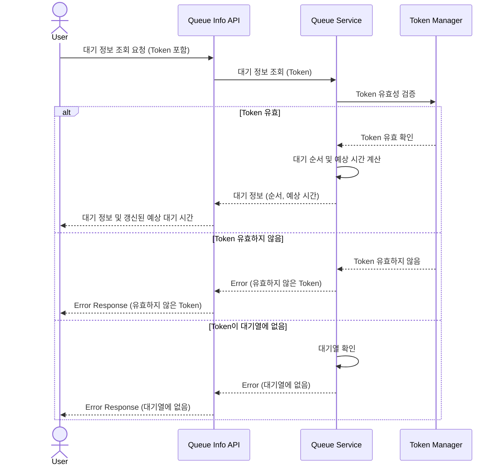

## 3. 예약 가능 정보 조회

### 3.0. 대기열 정보 조회시, 작업 진행 가능한 상태를 받은 상태

### 3.1. 한 콘서트의 예약 가능한 날짜 조회 API 호출

- 3.1.1. 예약 가능한 날짜 목록을 내려준다.
- 3.1.2. 만약 예약 가능한 날짜가 없다면, 빈 리스트를 내려준다.
- 3.1.3. 유효하지 않은 token 으로 호출한 경우, 해당 내용에 대응되는 Error Response 를 내려준다.
- 3.1.4. 알 수 없는 콘서트 정보로 호출한 경우, 해당 내용에 대응되는 Error Response 를 내려준다.

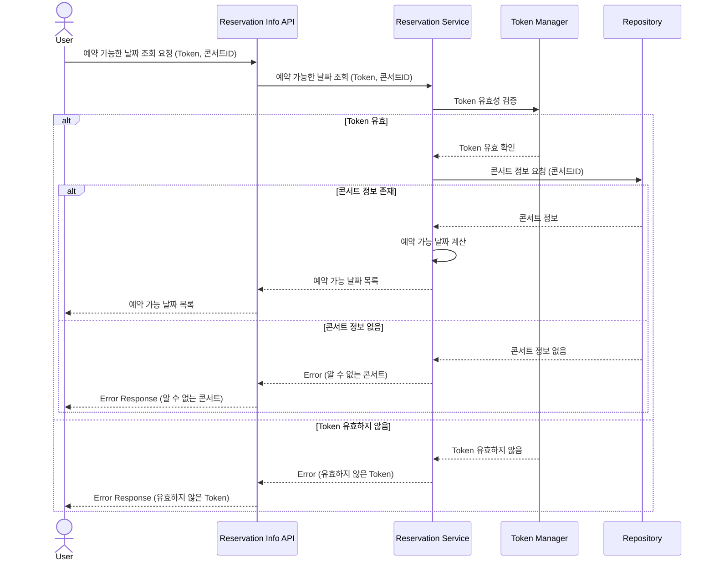

### 3.2. 한 콘서트의 예약 가능한, 특정 날짜로 예약 가능한 좌석 조회 API 호출

- 3.2.1. 예약 가능한 좌석 목록을 내려준다.
- 3.2.2. 만약 예약 가능한 좌석이 없다면, 빈 리스트를 내려준다.
- 3.2.3. 유효하지 않은 token 으로 호출한 경우, 해당 Error Response 를 내려준다.
- 3.2.4. 알 수 없는 콘서트 정보로 호출한 경우, 해당 내용에 대응되는 Error Response 를 내려준다.
- 3.2.5. 예약 가능하지 않은 날짜로 호출한 경우, 해당 내용에 대응되는 Error Response 를 내려준다.

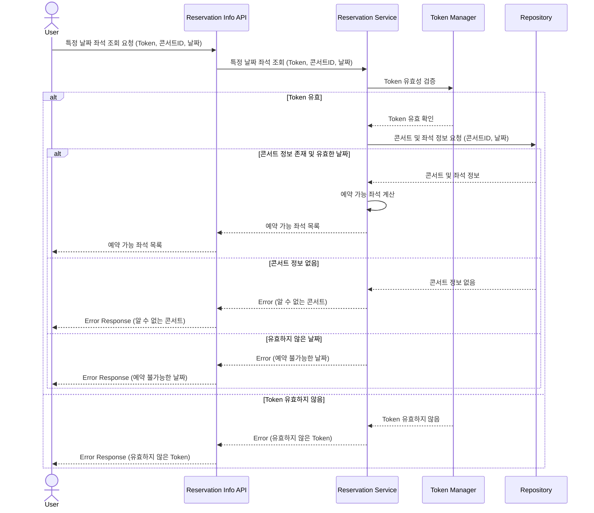

## 4. 좌석 점유

### 4.1 특정 콘서트의, 예약 가능한 특정 날짜의, 예약 가능한 특정 좌석에 대해 좌석 점유 API 호출

- 4.1.1. 좌석 점유에 성공해서, 점유한 좌석의 정보와 점유 시간 제한(5분)을 내려준다.
- 4.1.2. 유효하지 않은 token 으로 호출한 경우, 해당 내용에 대응 되는 Error Response 를 내려준다.
- 4.1.3. 이미 점유 혹은 예약된 좌석이라서 실패한 경우, 해당 내용에 대응 되는 Error Response 를 내려준다.
- 4.1.4. 알 수 없는 콘서트 정보로 호출한 경우, 해당 내용에 대응되는 Error Response 를 내려준다.
- 4.1.5. 예약 가능하지 않은 날짜로 호출한 경우, 해당 내용에 대응되는 Error Response 를 내려준다.

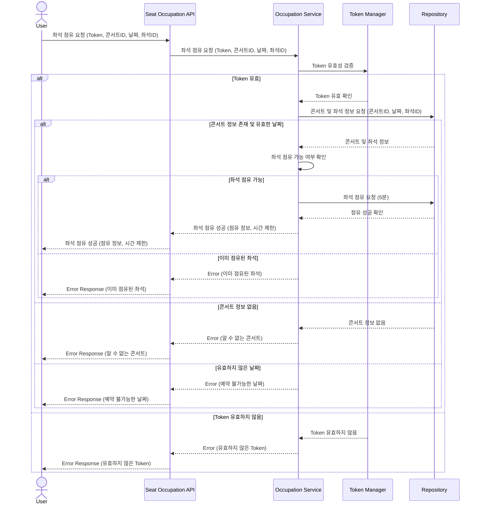

## 5. 좌석 예약

### 5.1 사용자가 점유한 좌석에 대해 예약 API 호출

- 5.1.1. 예약에 성공하면, 아래 작업을 완료한 뒤, 예약 정보를 반환한다
- 5.1.2. 유효하지 않은 token 으로 호출한 경우, 해당 내용에 대응되는 Error Response 를 반환한다.
- 5.1.3. 좌석의 점유 시간이 만료되어 예약할 수 없는 경우, 해당 내용에 대응되는 Error Response 를 반환한다.
- 5.1.4. 이미 예약된 좌석인 경우, 해당 내용에 대응되는 Error Response 를 반환한다

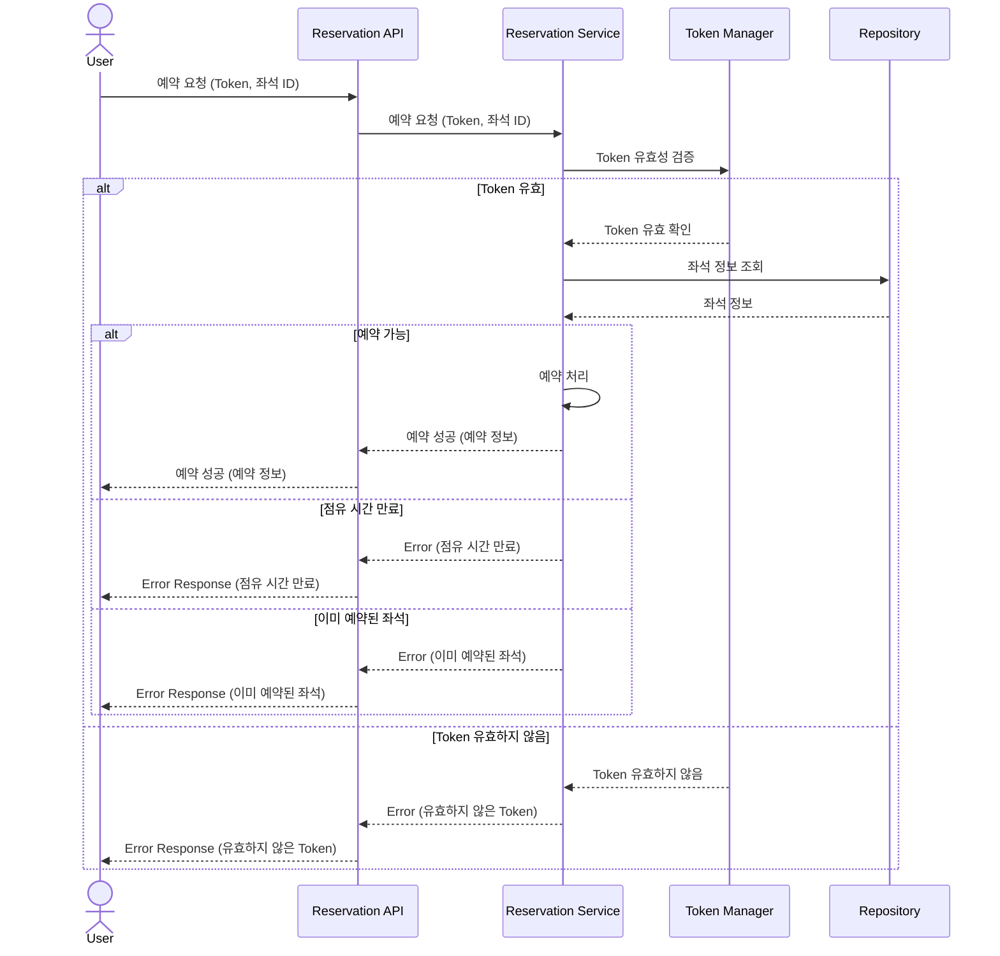

## 6. 결제

### 6.1 사용자가 점유한 좌석에 대해 결제 API 호출

- 6.1.1. 잔액이 충분하여 결제 성공이 되면, 아래 작업을 완료한 뒤, 예약 정보를 내려준다.
    - 결제 내역을 만든다.
    - 해당 좌석의 소유권을 사용자에게 위임한다.
    - 대기열 token 을 만료시킨다.
- 6.1.2. 유효하지 않은 token 으로 호출한 경우, 해당 내용에 대응 되는 Error Response 를 내려준다.
- 6.1.3. 잔액이 부족하여 결제할 수 없는 경우, 해당 내용에 대응 되는 Error Response 를 내려준다.
- 6.1.4. 좌석의 점유 시간이 만료되어 결제할 수 없는 경우, 해당 내용에 대응 되는 Error Response 를 내려준다.

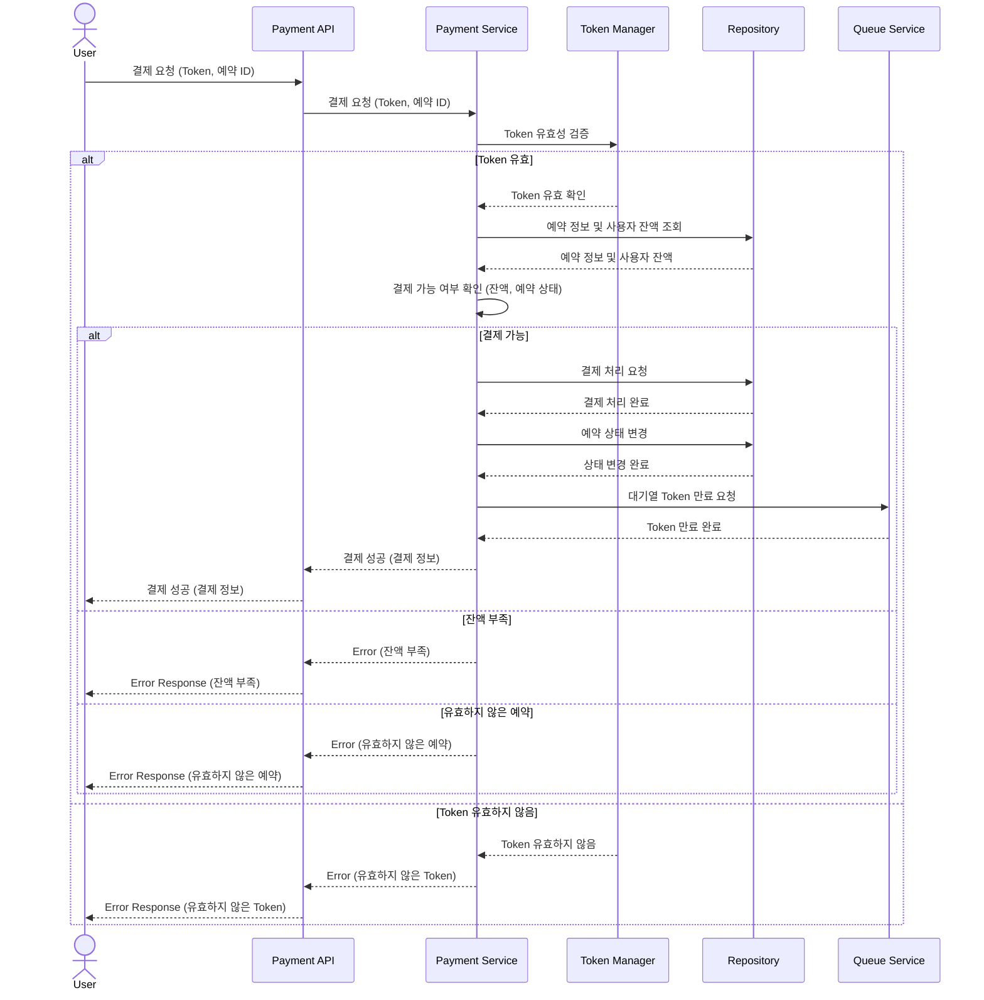

### 6.2 사용자가 결제 내역 목록 API 호출

- 6.2.1. 사용자의 결제 내역 목록을 내려준다.
- 6.2.2. 만약 결제 내역이 없다면, 빈 리스트를 내려준다.

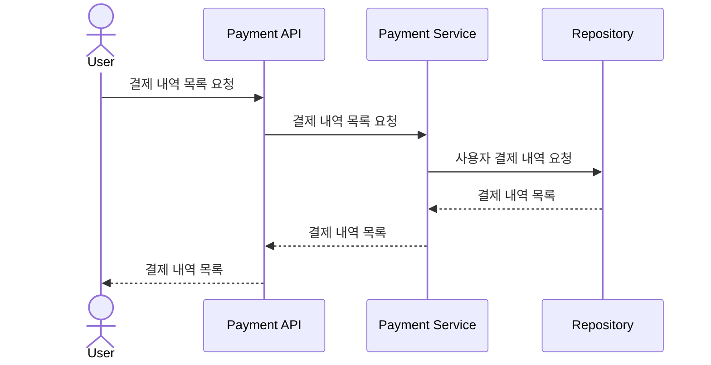

## 7. 잔액 관리

### 7.1 사용자가 잔액 조회 API 호출

- 7.1.1. 사용자의 현재 잔액 정보를 반환한다.

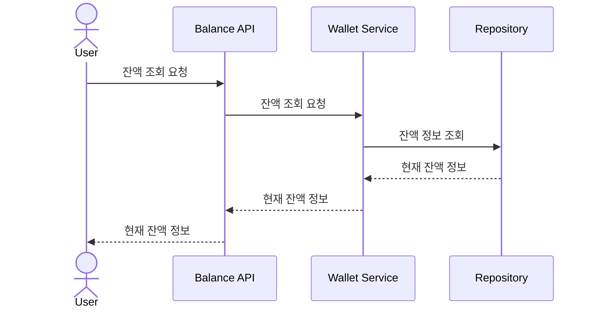

### 7.2 사용자가 잔액 충전 API 호출

- 7.2.1. 충전이 성공적으로 처리되면, 시스템이 충전 처리 후 갱신된 잔액 정보를 반환한다.

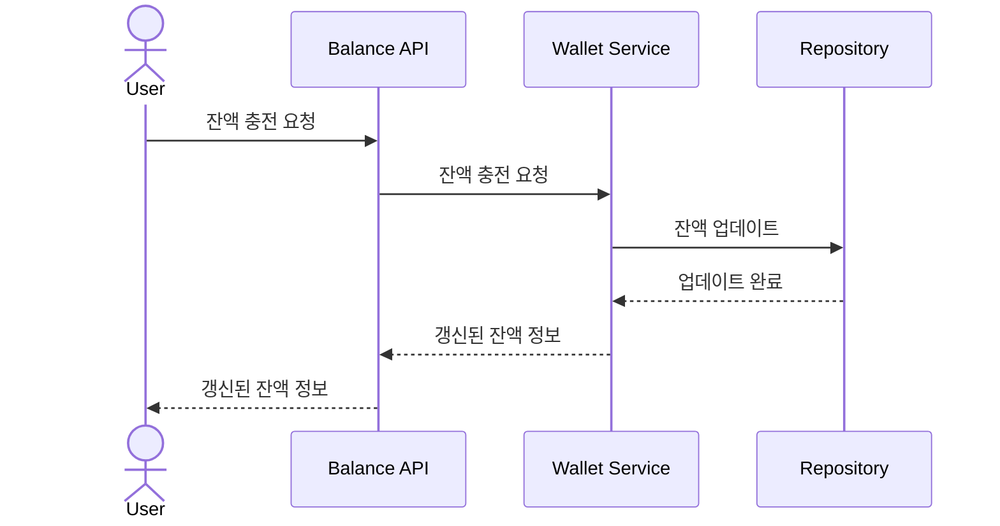

## 8. 시스템 백그라운드 프로세스

### 8.1 대기열 관리

- 8.1.1. 시스템이 주기적으로 사용자의 최근 API 호출 시간을 확인한다.
- 8.1.2. 일정 시간이 경과한 사용자를 발견하면, 해당 사용자를 대기열에서 자동으로 제거한다.
- 8.1.3. 제거된 사용자의 token 을 무효화한다.

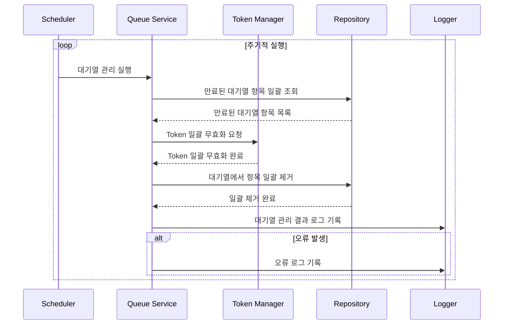

### 8.2 좌석 점유 만료 관리

- 8.2.1. 시스템이 주기적으로 점유된 좌석의 점유 시간을 확인한다.
- 8.2.2. 점유 시간이 만료된 좌석을 발견하면, 해당 좌석의 점유를 자동으로 해제한다.
- 8.2.3. 해제된 좌석을 다시 예약 가능한 상태로 변경한다.

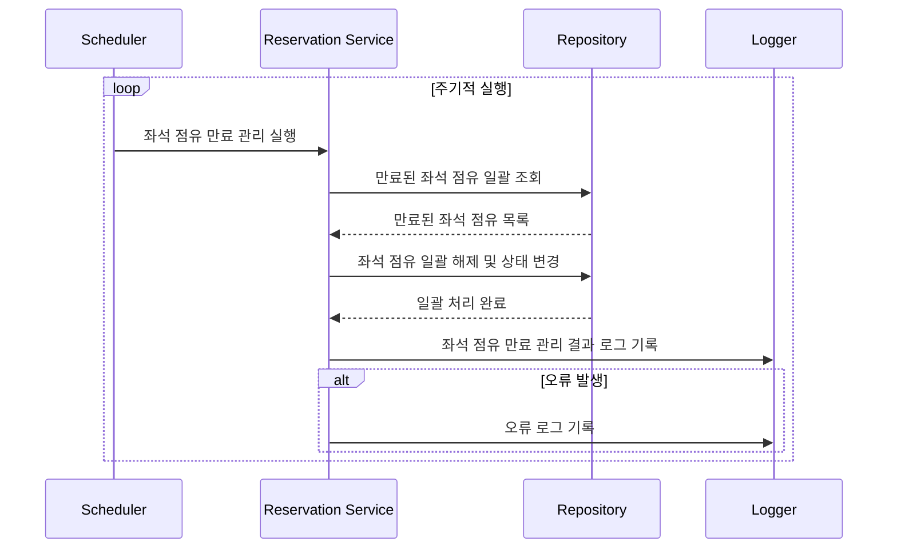

### 8.3 예외 처리

- 8.3.1. 백그라운드 프로세스 실행 중 오류가 발생한 경우, 시스템이 오류 로그를 기록한다.